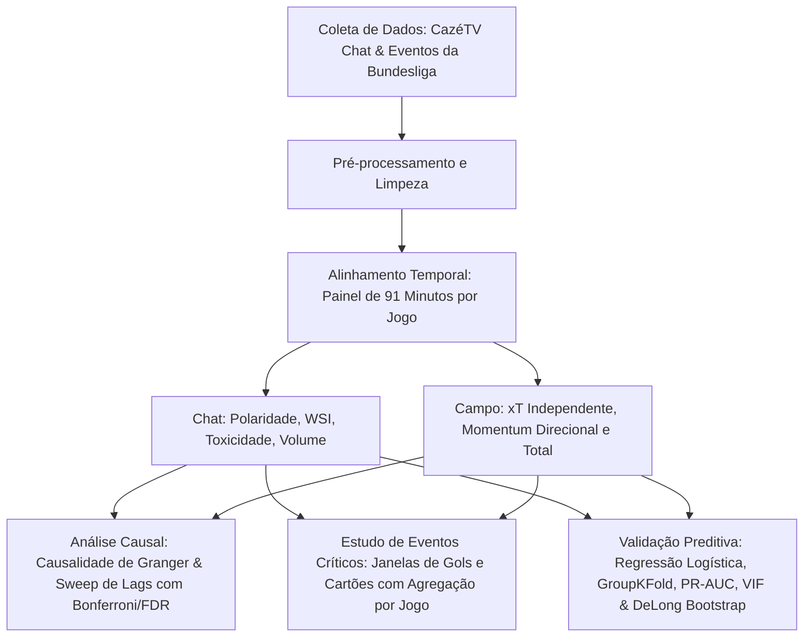

# Metodologia de Pesquisa: Sentimento em Tempo Real e Eventos de Campo

Este documento apresenta a metodologia consolidada do estudo *"Antecipando o Apito: A Correlação entre o Sentimento em Tempo Real e Eventos de Campo em Transmissões Digitais"*. A estrutura a seguir detalha o pipeline de dados, a modelagem matemática e os procedimentos estatísticos aplicados, formatados de maneira didática para servir de base direta para slides de apresentação acadêmica.

---

## 1. Visão Geral do Pipeline Metodológico

A metodologia integra dados qualitativos de interações humanas em tempo real com métricas quantitativas de desempenho em campo. O fluxo de processamento de dados é resumido na seguinte estrutura lógica:

* **Coleta:** Chat do YouTube ao vivo (CazéTV) e eventos detalhados de campo.
* **Alinhamento:** Agrupamento em minutos discretos de $0$ a $90$.
* **Modelagem:** Verificação de estacionariedade, testes causais, análise de reatividade e avaliação do poder de previsão sem vazamento temporal.

---

## 2. Definições e Formulações Matemáticas das Variáveis

Para garantir a reprodutibilidade e o rigor acadêmico, as variáveis do estudo são formuladas da seguinte forma (onde $Pos_t$, $Neg_t$ e $Neu_t$ representam a contagem de comentários positivos, negativos e neutros no minuto $t$, respectivamente):

### 2.1. Métricas de Sentimento e Engajamento do Chat

* **Volume Total de Mensagens ($volume\_total_t$):**
  $$volume\_total_t = pos\_comments_t + neg\_comments_t + neu\_comments_t$$

* **Polaridade Sentimental ($Polaridade_t$):**
  Mede a inclinação sentimental líquida no minuto $t$. Varia entre $-1$ (totalmente negativo) e $+1$ (totalmente positivo):
  $$Polaridade_t = \frac{pos\_comments_t - neg\_comments_t}{volume\_total_t} \quad \text{se } volume\_total_t > 0 \text{, caso contrário } 0$$

* **Índice de Sentimento Ponderado pelo Engajamento ($WSI_t$):**
  Pondera o saldo sentimental pelo volume de atividade, amplificando reações em picos de audiência:
  $$WSI_t = Polaridade_t \times \ln(volume\_total_t + 1)$$

* **Razão de Toxicidade ($ToxicityRatio_t$):**
  Proporção de mensagens com conotação negativa ou hostil, com termo de amortecimento no denominador para evitar divisões por zero:
  $$ToxicityRatio_t = \frac{neg\_comments_t}{volume\_total_t + 10^{-5}}$$

* **Taxa de Volume de Mensagens ($VolumeRate_t$):**
  Velocidade de engajamento medida em mensagens por segundo:
  $$VolumeRate_t = \frac{volume\_total_t}{60.0}$$

---

### 2.2. Métricas de Desempenho e Intensidade em Campo

* **Ameaça Esperada ($xT$ - Expected Threat):**
  Mapeamento espacial da probabilidade de um lance resultar em gol, calibrado em uma grade de $16 \times 12$ células.
  > [!IMPORTANT]
  > **Calibração Livre de Endogeneidade:** Para evitar a circularidade preditiva (vazamento de dados dos gols do teste), a grade de xT foi calibrada usando exclusivamente **243 partidas independentes** da Bundesliga que não possuíam dados de chat.
  
  A calibração iterativa da célula $(x,y)$ baseia-se na probabilidade de finalização $s(x,y)$ e progressão $1 - s(x,y)$:
  $$xT_{k+1}(x, y) = s(x, y) \times g(x, y) + (1 - s(x, y)) \times xT_k(x, y)$$
  onde $g(x,y)$ é a taxa de gols histórica a partir da célula $(x,y)$.

* **Diferença de Ameaça Esperada ($xt\_diff_t$):**
  $$xt\_diff_t = xT_{home, t} - xT_{away, t}$$

* **Momentum Direcional ($Momentum_t$):**
  Média móvel de 5 minutos da diferença de xT, capturando a superioridade ofensiva recente de uma equipe sobre a outra:
  $$Momentum_t = \sum_{k=0}^{4} xT_{home, t-k} - \sum_{k=0}^{4} xT_{away, t-k}$$

* **Ameaça Esperada Total ($xt\_total_t$):**
  Métrica não-direcional que mede a periculosidade ofensiva global da partida, somando as ações de ambos os times:
  $$xt\_total_t = xT_{home, t} + xT_{away, t}$$

* **Momentum Total ($MomentumTotal_t$):**
  Intensidade ofensiva recente acumulada de forma não-direcional (soma móvel de 5 minutos do xT total):
  $$MomentumTotal_t = \sum_{k=0}^{4} xt\_total_{t-k}$$

---

## 3. Alinhamento Temporal e Não-Estacionariedade

* **Grid Temporal:** As métricas foram consolidadas minuto a minuto, gerando uma série de 91 observações por partida ($t = 0, 1, \dots, 90$).
* **Amostra Analítica:** Das 63 partidas iniciais da temporada 2024-2025 da Bundesliga transmitidas pela CazéTV, 9 foram removidas por falta de atividade no chat, resultando em uma amostra efetiva de **54 partidas**.
* **Interpolação:** Em minutos isolados onde o chat não registrou mensagens, foi aplicada interpolação linear limitada para preencher as variáveis sentimentais, evitando a criação artificial de picos afetivos.
* **Teste de Estacionariedade (Dickey-Fuller Aumentado):** Como as séries temporais em nível exibem tendências de longo prazo e dependência temporal severa (o que invalida testes de regressão e causalidade comuns), aplicou-se o teste ADF.
* **Transformação em Diferenças:** Identificada a não-estacionariedade, todas as variáveis foram transformadas por meio da primeira diferença temporal:
  $$\Delta X_t = X_t - X_{t-1}$$
  Os testes estatísticos de Granger foram conduzidos sob as séries em primeira diferença, eliminando a ocorrência de correlações espúrias.

---

## 4. Testes Causais e Sweep de Defasagens (Granger)

O teste de causalidade de Granger investiga se os valores passados de uma variável de campo ajudam a prever o sentimento do chat atual, controlando a inércia temporal do próprio chat:
$$Y_t = c + \sum_{i=1}^{p} \alpha_i Y_{t-i} + \sum_{i=1}^{p} \beta_i X_{t-i} + \epsilon_t$$
A hipótese nula $H_0: \beta_1 = \beta_2 = \dots = \beta_p = 0$ é testada via teste F.

* **Agregação de Partidas:** O teste é executado partida por partida. Os p-valores individuais são combinados usando o Método de Fisher para p-valores combinados.
* **Prevenção de Falsos Positivos (Múltiplas Comparações):** Realizou-se um sweep exaustivo de defasagens de $p=1$ a $p=4$ minutos em ambos os sentidos (Campo $\rightarrow$ Chat e Chat $\rightarrow$ Campo).
* **Correção de Bonferroni e FDR:** O sweep de lags totaliza 128 testes sob a escala de diferenças. Para evitar conclusões baseadas em p-valores casuais, aplicou-se a severa correção de Bonferroni (limiar $\alpha_{Bonf} = 0,05 / 128 = 0,00039$) e o controle da taxa de falsas descobertas (FDR Benjamini-Hochberg).

---

## 5. Estudo de Eventos Críticos (Janelas de Gols e Cartões)

O estudo de eventos avalia o comportamento dinâmico do sentimento WSI e do volume de chat em uma janela de 11 minutos ao redor de eventos críticos (de $t-5$ a $t+5$, onde $t=0$ representa o minuto do evento).

* **Resolução de Graus de Liberdade Inflados:**
  > [!CAUTION]
  > Tratar gols ou cartões individuais como observações independentes ignora a dependência de dados ocorridos no mesmo jogo, reduzindo artificialmente os p-valores.
  
  Para resolver esse problema, agrupamos as observações calculando a média da janela pré-evento ($t-2, t-1$) e a média da linha de base de forma agregada **por partida** ($n=52$ jogos com gols). Os testes t emparelhados e os testes de Wilcoxon Signed-Rank aplicados sobre essas médias por jogo evitam conclusões estatísticas superestimadas.

---

## 6. Validação Preditiva de Curtíssimo Prazo

Para testar se os dados de chat agem como antecipadores de gols, estruturou-se uma tarefa de classificação binária: prever se haverá um gol nos minutos $t+1$ ou $t+2$ a partir do minuto atual $t$.

* **0% Look-Ahead Leakage:** Excluiu-se qualquer uso de médias móveis centradas ou dados futuros nas variáveis preditoras do chat. O modelo utiliza apenas dados defasados e disponíveis no minuto $t$.
* **Validação Cruzada Agrupada (GroupKFold):** A separação de treino e teste foi dividida em 5 folds baseados nas partidas. Isso garante que minutos de um mesmo jogo nunca estejam simultaneamente no treino e teste, evitando vazamento espacial de dinâmica de torcida.
* **Mapeamento de Desbalanceamento Extremo:** Como o gol ocorre em apenas ~8,72% dos minutos, o modelo logístico foi ajustado com pesos de classe balanceados. O desempenho foi medido estritamente pelas métricas PR-AUC (Precision-Recall Area Under Curve), Brier Score (calibração de probabilidade) e curvas ROC-AUC.
* **Teste de DeLong Bootstrap:** Realizado com 500 iterações para testar a significância estatística da superioridade preditiva do Chat vs. Campo.
* **Fator de Inflação de Variância (VIF):** Calculado para todos os preditores do modelo combinado para provar a ausência de multicolinearidade.

---

## 7. Roteiro Prático para Slides de Apresentação (Guia dos Colegas)

Para a construção dos slides, os colegas do grupo podem utilizar a seguinte divisão e resumo de tópicos:

### Slide 1: Introdução e Objetivo do Estudo
* **Título:** Sentimento em Tempo Real vs. Eventos de Campo no Futebol.
* **Pergunta de Pesquisa:** O comportamento dos torcedores no chat do YouTube ao vivo (CazéTV) reflete a dinâmica tática de campo? O chat pode prever gols antes que ocorram?
* **Amostra:** 54 partidas da Bundesliga 2024-2025 (exclusão de 9 jogos sem chat ativo). Agregação minuto a minuto (0-90 min).

### Slide 2: Metodologia e Variáveis (O Coração Técnico)
* **Variáveis de Chat:** Volume de mensagens por segundo, Polaridade Sentimental (saldo líquido positivo/negativo) e WSI (sentimento ponderado por engajamento logarítmico).
* **Variáveis de Campo:** Expected Threat (xT) e Momentum (pressão ofensiva acumulada).
* **Calibração Segura do xT:** Grade de xT calibrada em 243 partidas independentes para evitar circularidade preditiva nos dados de teste.

### Slide 3: Estacionariedade e Causalidade de Granger
* **Desafio:** Séries temporais em nível contêm tendências comuns de longo prazo (correlações espúrias).
* **Solução:** Aplicação do Teste Dickey-Fuller Aumentado (ADF) e conversão para primeiras diferenças ($\Delta$).
* **Fórmula de Causalidade:** VAR estruturado com defasagens de 1 a 4 minutos.
* **Correção Estatística:** Sweep de 128 testes causais corrigidos por Bonferroni e Benjamini-Hochberg (FDR) para eliminar falsos positivos.

### Slide 4: Principais Resultados de Causalidade (RQ1)
* **Paradoxo do Cancelamento em Chats Mistos:** Variações rápidas de sentimentos e volume direcionados a uma equipe não causam o sentimento geral do chat. Em transmissões abertas, a celebração de um lado anula-se com a frustração do outro.
* **Causalidade Restabelecida em Métricas Não-Direcionais:** A variação da intensidade geral do esporte (xT e Momentum totais) Granger-causa variações na polaridade ($p=0,0095$), WSI ($p=0,0383$) e toxicidade ($p=0,0293$) do chat.
* **A Latência de Reação:** O impacto causal surge de forma consistente na defasagem de **2 minutos**, refletindo o atraso de streaming e o tempo de reação física do torcedor.

### Slide 5: Estudo de Eventos Críticos (RQ2 - Parte 1)
* **Reatividade Absoluta:** O chat é altamente reativo. O volume de mensagens aumenta em $1,83\times$ para gols e $1,27\times$ para cartões no minuto do evento.
* **Ajuste de Graus de Liberdade:** Agregação por partida ($n=52$ jogos com gols) em vez de gols individuais ($n=195$) para corrigir dependência de dados intra-jogo.
* **Sentimento Pré-Gol:** O sentimento WSI pré-gol médio ($-0,0790$) é ligeiramente menos negativo que a linha de base ($-0,1900$), mas a significância é marginal ($p \approx 0,06$ nos testes t e Wilcoxon). Há um sinal de aquecimento emocional sutil, mas não astronômico.

### Slide 6: O Chat como Sensor Preditivo (RQ2 - Parte 2)
* **Tarefa:** Prever gols nos próximos 2 minutos ($t+1$ e $t+2$) usando preditores coletados no minuto atual $t$.
* **Desempenho Comparativo (Precision-Recall AUC):**
  * *Apenas Campo:* PR-AUC = 0,0805 (IC 95%: [0,0716, 0,0900]) — pior que a classificação aleatória.
  * *Apenas Chat:* PR-AUC = **0,1030** (IC 95%: [0,0896, 0,1216]) — estatisticamente superior à linha de base aleatória de 0,0872 e ao modelo de campo.
* **Significância:** Teste de DeLong bootstrap atesta superioridade preditiva do chat ($p = 0,0050$).
* **VIF & Multicolinearidade:** Todos os VIFs $< 1,40$. O coeficiente negativo de xT ($\beta = -0,0600$) é uma característica esportiva real (defensive resets e bolas paradas) e não interferência de colinearidade.
* **Conclusão:** O chat atua como um sensor social que capta a pressão cumulativa e o posicionamento de bolas paradas que os modelos estatísticos tradicionais de campo desconsideram minuto a minuto.
