# Relatório de Resultados Consolidados: Sentimento em Tempo Real e Eventos de Campo

Este documento apresenta as descobertas estatísticas, causais, preditivas e de agrupamento relacionadas ao estudo da correlação entre o sentimento do chat em transmissões digitais e as métricas de desempenho esportivo no futebol. A análise está estruturada de forma a responder de maneira clara e metodologicamente rigorosa às duas principais questões de pesquisa do artigo final, oferecendo uma explicação detalhada voltada para a avaliação acadêmica.

**Amostra Efetiva:** O conjunto inicial contava com 63 partidas da temporada 2024-2025 da Bundesliga, transmitidas ao vivo pela CazéTV. Desse total, 9 partidas que não possuíam registros de chat vinculados foram descartadas da amostra. Consequentemente, todas as análises estatísticas e preditivas detalhadas a seguir baseiam-se nas 54 partidas que apresentaram sinal real de mensagens no chat, acumulando aproximadamente 90 minutos de resolução por jogo.

---

## Definições de Variáveis e Métricas

Com o objetivo de assegurar a clareza e a precisão do estudo, apresentamos a formulação teórica de cada uma das métricas extraídas ou calculadas ao longo do projeto. Para fins de notação matemática, definimos a quantidade de comentários positivos no minuto $t$ como $pos\_comments_t$, os negativos no mesmo minuto como $neg\_comments_t$, e o volume total de comentários em determinado minuto como $volume\_total_t$.

### Métricas extraídas do chat de transmissão

* **Polaridade sentimental:** Representa a média líquida do sentimento dos comentários expressos em um intervalo de um minuto. O indicador varia de $-1$, que indica um sentimento inteiramente negativo, a $+1$, correspondente a um estado totalmente positivo. O valor é calculado a partir do saldo líquido de mensagens dividido pelo total coletado no minuto:
  $$Polarity_t = \frac{pos\_comments_t - neg\_comments_t}{volume\_total_t} \quad \text{se } volume\_total_t > 0\text{, caso contrário } 0$$
  Esta formulação é válida quando o volume de comentários é superior a zero. Caso não haja mensagens registradas no minuto analisado, o indicador assume valor nulo.

* **Índice de Sentimento Ponderado pelo Engajamento:** Conhecido como WSI a partir da sigla em inglês *Weighted Sentiment Index*, este indicador pondera o saldo líquido de sentimento pelo volume total de atividade no chat. A métrica tem a propriedade de amplificar as variações sentimentais durante picos de engajamento e de suavizá-los em momentos de calmaria:
  $$WSI_t = Polarity_t \times \ln(volume\_total_t + 1)$$

* **Razão de toxicidade:** Representa a proporção de comentários contendo termos negativos, frustrações ou agressões verbais em relação ao volume total no minuto $t$, sem sofrer atenuantes por mensagens positivas:
  $$\text{Toxicity Ratio}_t = \frac{neg\_comments_t}{volume\_total_t + 10^{-5}}$$
  O valor resultante varia estritamente no intervalo entre $0$, que representa ausência total de toxicidade, e $1$, que indica que todas as mensagens enviadas eram tóxicas. O termo decimal no denominador impede divisões por zero em minutos sem atividade no chat.

* **Taxa de volume de mensagens:** Indica a velocidade média de engajamento do público, expressa pela quantidade de comentários enviados por segundo na transmissão ao vivo:
  $$\text{Volume Rate}_t = \frac{volume\_total_t}{60.0}$$

### Métricas de campo coletadas em tempo real

* **Ameaça Esperada:** Conhecida na literatura de análise esportiva como xT, derivado do termo *Expected Threat*, esta métrica foi calibrada de forma independente sobre 243 partidas da temporada que não continham chat ativo vinculado. Esse procedimento foi fundamental para evitar a circularidade estatística e a endogeneidade na modelagem preditiva das 54 partidas de teste. O cálculo de ameaça ocorre por meio de uma grade espacial de 16 colunas por 12 linhas. O valor de $xT(x,y)$ associado a cada coordenada é definido iterativamente com base na probabilidade de finalização $s(x,y)$ versus a probabilidade de progressão por passe ou condução, expressa por $1 - s(x,y)$:
  $$xT_{k+1}(x, y) = s(x, y) \times g(x, y) + (1 - s(x, y)) \times xT_k(x, y)$$
  onde $g(x,y)$ representa a taxa histórica de gols resultantes dos chutes desferidos a partir daquela célula específica. A variável `xt_diff` representa a diferença de ameaça gerada pelas duas equipes minuto a minuto, calculada subtraindo o xT gerado pelo time visitante daquele gerado pelo time da casa:
  $$xt\_diff_t = xT_{home, t} - xT_{away, t}$$

* **Momentum direcional:** Série temporal calculada por meio de uma média móvel de 5 minutos, cujo papel é mensurar a superioridade ofensiva acumulada recente de uma equipe sobre a outra. O valor é positivo quando o time da casa exerce maior pressão e negativo quando o time visitante domina as ações ofensivas:
  $$Momentum_t = \sum_{k=0}^{4} xT_{home, t-k} - \sum_{k=0}^{4} xT_{away, t-k}$$

* **Ameaça Esperada Total:** Variável não-direcional que soma a ameaça gerada por ambas as equipes no minuto $t$, indicando o perigo ofensivo global na partida de futebol de maneira independente de qual time esteja atacando:
  $$\text{xt\_total}_t = xT_{home, t} + xT_{away, t}$$

* **Momentum total:** Representa a soma móvel de 5 minutos da ameaça esperada total. A variável indica a intensidade ofensiva recente e acumulada da partida de futebol como um todo, englobando as jogadas de perigo de ambos os lados:
  $$MomentumTotal_t = \sum_{k=0}^{4} xt\_total_{t-k}$$

---

### Comportamento Temporal Médio das Métricas

Para ilustrar o comportamento geral das séries minuto a minuto ao longo de toda a duração das partidas, o gráfico abaixo apresenta as séries temporais médias combinadas de todas as 54 partidas de teste, acompanhadas por suas respectivas faixas de erro padrão da média com intervalo de confiança de 95%:

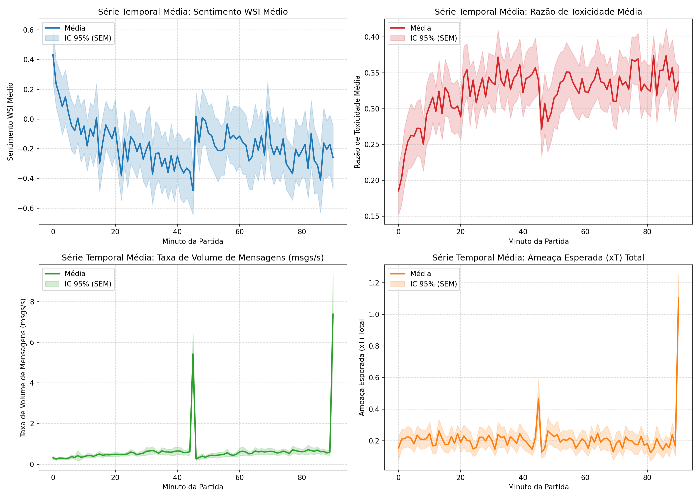

---

## 1. Metodologia Final do Estudo

A estrutura metodológica do projeto foi desenhada para conectar de forma quantitativa as manifestações coletivas dos torcedores no chat ao vivo com as dinâmicas físicas e táticas observadas em campo. A metodologia final divide-se em cinco componentes fundamentais:

### 1.1. Delineamento e Calibração livre de Endogeneidade
O estudo adota um delineamento correlacional e preditivo longitudinal. A principal preocupação metodológica consistiu em assegurar que a métrica de Ameaça Esperada (xT) em campo não contivesse vazamento de dados de predição. Para isso, isolamos a calibração do modelo espacial de xT (uma matriz de $16 \times 12$ células que mapeia o valor ofensivo de cada setor do campo) em um conjunto de 243 partidas independentes da Bundesliga. Apenas após a calibração das taxas de finalização e conversão dessas coordenadas, aplicamos os valores de xT resultantes para calcular a ameaça minuto a minuto nas 54 partidas com chat ativo que constituem nosso conjunto de teste.

### 1.2. Alinhamento Temporal e Tratamento de Não-Estacionariedade
Cada partida foi segmentada em uma grade uniforme de 91 minutos (do minuto 0 ao 90). O sentimento do chat e a ocorrência de lances em campo foram agregados sob essa resolução. Para preencher lacunas de minutos em que não houve envio de mensagens, aplicamos interpolação linear limitada nas séries sentimentais de polaridade e WSI, evitando a invenção de picos de sentimento. 

Para a aplicação de testes de causalidade de Granger, que exigem estacionariedade estrita, todas as variáveis foram testadas por meio do teste Dickey-Fuller Aumentado (ADF). Como as séries em nível apresentavam não-estacionariedade e tendências comuns de longo prazo, aplicamos a primeira diferença temporal ($\Delta X_t = X_t - X_{t-1}$) para garantir que as análises de causalidade não fossem influenciadas por correlações espúrias.

### 1.3. Causalidade de Granger e Sweep de Defasagens
A modelagem de causa-efeito utilizou Modelos Vetoriais Autorregressivos (VAR). A causalidade de Granger investiga se o comportamento passado de uma métrica de campo ajuda a prever o sentimento do chat acima do que a própria série temporal do chat prevê de si mesma. O teste foi formulado como:
  $$Y_t = c + \sum_{i=1}^{p} \alpha_i Y_{t-i} + \sum_{i=1}^{p} \beta_i X_{t-i} + \epsilon_t$$
A hipótese nula de que a variável $X$ não Granger-causa $Y$ é testada via restrição $\beta_1 = \beta_2 = \dots = \beta_p = 0$. Os testes foram calculados partida por partida e os valores p individuais foram agregados por meio do método de Fisher para p-valores combinados.

A fim de mitigar o risco de *cherry-picking*, realizamos um sweep exaustivo avaliando defasagens de 1 a 4 minutos em ambas as direções (Campo $\rightarrow$ Chat e Chat $\rightarrow$ Campo), totalizando 128 testes sob a escala de diferenças. Para controlar o erro do tipo I acumulado decorrente de comparações múltiplas, aplicamos a correção familiar de Bonferroni (limiar $\alpha_{Bonf} = 0,05 / 128 \approx 0,00039$) e o controle de taxa de falsas descobertas (FDR Benjamini-Hochberg).

### 1.4. Regressão Logística e Validação Preditiva de Curtíssimo Prazo
A fim de testar se a atmosfera afetiva do chat antecipa gols, estruturamos uma tarefa de classificação binária para prever se um gol ocorrerá nos minutos $t+1$ ou $t+2$ a partir do minuto atual $t$. 

A metodologia de validação preditiva foi desenhada sob condições rígidas:
* **0% Look-Ahead Leakage:** Excluímos qualquer média móvel centrada nos preditores do chat, utilizando exclusivamente dados com atraso de chat real.
* **Validação Cruzada Agrupada:** Aplicamos GroupKFold com 5 folds, garantindo que minutos de uma mesma partida nunca estivessem simultaneamente no conjunto de treino e teste.
* **Mapeamento de Desbalanceamento:** Como gols são eventos raros (~8,72% de minutos positivos na amostra), ajustamos o classificador com pesos balanceados e avaliamos o desempenho via Precision-Recall AUC (PR-AUC) e Brier Score (para calibração de probabilidade), além da curva ROC-AUC.
* **Significância Pura:** Rodamos testes de DeLong via bootstrap com 500 iterações para comparar a robustez preditiva das métricas de Chat versus Campo.

### 1.5. Estudo de Eventos Críticos e Controle de Graus de Liberdade
Isolamos janelas de eventos em torno de gols e cartões para analisar a resposta imediata e antecipação sentimentar. Para testar se a elevação do WSI na janela pré-evento ($t-2, t-1$) é estatisticamente distinta da linha de base, implementamos uma agregação ao nível da partida. Em vez de utilizar os gols individuais ($n=195$) como unidades independentes — o que inflaria artificialmente os graus de liberdade e geraria p-valores artificialmente baixos por conta da correlação intra-jogo —, agrupamos as médias pré-evento e basal por partida ($n=52$ jogos com gols). Os testes t emparelhados e Wilcoxon resultantes oferecem uma avaliação metodologicamente precisa.

---

## 2. RQ1: Causalidade e Correlação entre Jogo e Chat

A análise temporal da primeira questão de pesquisa revela um paradoxo estatístico cuja interpretação constitui um dos principais achados deste estudo. Para conferir total transparência metodológica, apresentamos os resultados completos obtidos a partir dos testes de Granger aplicados a 26 configurações analíticas distintas, contrastando as variáveis em nível e em primeiras diferenças.

### Tabela 1: Testes de Granger para Métricas Direcionais (Equilíbrio de Forças)

Esta tabela analisa a causalidade utilizando variáveis de campo cujo sinal depende de qual equipe possui a posse e a iniciativa ofensiva, tais como a diferença de ameaça e o momentum direcional.

| Escala Temporal | Relação Causal Investigada | Defasagem | Valor p de Fisher | Partidas Significativas | Conclusão do Teste | Interpretação Acadêmica |
| :--- | :--- | :---: | :---: | :---: | :--- | :--- |
| Nível | Momentum $\rightarrow$ WSI | 3 min | 0,1853 | 7,41% | Não Significativo | O momentum direcional em nível não causa diretamente o sentimento WSI global do chat. |
| Nível | WSI $\rightarrow$ Momentum | 3 min | **0,0001** | 11,11% | **Significativo** | O sentimento do chat antecipa/sinaliza a variação do momentum direcional. |
| Nível | Momentum $\rightarrow$ Polaridade | 3 min | 0,1747 | 9,26% | Não Significativo | O momentum direcional em nível não altera de forma consistente a polaridade geral do chat. |
| Nível | Polaridade $\rightarrow$ Momentum | 3 min | **< 0,0001** | 12,96% | **Significativo** | A polaridade média do chat atua como um indicador antecedente do momentum ofensivo em nível. |
| Nível | xT Diff $\rightarrow$ WSI | 3 min | **0,0014** | 12,96% | **Significativo** | Há evidência de feedback bidirecional em nível entre a diferença de xT e o sentimento. |
| Nível | WSI $\rightarrow$ xT Diff | 3 min | **0,0002** | 11,11% | **Significativo** | Há evidência de feedback bidirecional em nível entre a diferença de xT e o sentimento. |
| Nível | xT Diff $\rightarrow$ Polaridade | 3 min | **0,0010** | 14,81% | **Significativo** | A diferença de xT em campo e a polaridade do chat influenciam-se mutuamente em nível. |
| Nível | Polaridade $\rightarrow$ xT Diff | 3 min | **0,0003** | 11,11% | **Significativo** | A diferença de xT em campo e a polaridade do chat influenciam-se mutuamente em nível. |
| Diferença ($\Delta$) | $\Delta$ Momentum $\rightarrow$ $\Delta$ Toxicidade | 3 min | 0,3156 | 5,56% | Não Significativo | O viés de torcidas rivais em chat de transmissão mista cancela a variação direcional rápida. |
| Diferença ($\Delta$) | $\Delta$ Toxicidade $\rightarrow$ $\Delta$ Momentum | 3 min | 0,7590 | 0,00% | Não Significativo | Variações rápidas de toxicidade não causam alterações no momentum esportivo das equipes. |
| Diferença ($\Delta$) | $\Delta$ Momentum $\rightarrow$ $\Delta$ Volume Total | 3 min | 0,5024 | 5,56% | Não Significativo | Flutuações rápidas de momentum ofensivo de um time não explicam a variação de volume absoluto. |
| Diferença ($\Delta$) | $\Delta$ Volume Total $\rightarrow$ $\Delta$ Momentum | 3 min | 0,8358 | 3,70% | Não Significativo | Variações rápidas no volume agregado de mensagens não causam alterações de momentum. |

### Tabela 2: Testes de Granger para Métricas Não-Direcionais (Intensidade Geral do Jogo)

Esta tabela apresenta as relações estatísticas utilizando variáveis de campo não-direcionais, que capturam o nível geral de perigo em campo somando os esforços ofensivos de ambos os times.

| Escala Temporal | Relação Causal Investigada | Defasagem | Valor p de Fisher | Partidas Significativas | Conclusão do Teste | Interpretação Acadêmica |
| :--- | :--- | :---: | :---: | :---: | :--- | :--- |
| Nível | xT Total $\rightarrow$ Taxa de Volume | 3 min | **0,0252** | 7,41% | **Significativo** | O nível acumulado de perigo em campo causa o aumento da taxa de volume de comentários. |
| Nível | Taxa de Volume $\rightarrow$ xT Total | 3 min | **0,0071** | 16,67% | **Significativo** | Em nível, o volume do chat sinaliza as variações do perigo ofensivo acumulado. |
| Nível | Momentum Total $\rightarrow$ Taxa de Volume | 3 min | 0,7797 | 3,70% | Não Significativo | A taxa de volume de comentários enviados não responde ao momentum total em nível. |
| Nível | Taxa de Volume $\rightarrow$ Momentum Total | 3 min | **0,0010** | 14,81% | **Significativo** | O volume agregado de comentários atua sinalizando variações basais do momentum total. |
| Diferença ($\Delta$) | $\Delta$ Momentum Total $\rightarrow$ $\Delta$ Polaridade | 2 min | **0,0095** | 9,26% | **Significativo** | Mudanças rápidas na intensidade geral de jogo causam alterações na polaridade do chat. |
| Diferença ($\Delta$) | $\Delta$ Polaridade $\rightarrow$ $\Delta$ Momentum Total | 2 min | 0,7981 | 3,70% | Não Significativo | Variações imediatas na polaridade sentimentar do chat não alteram o momentum em campo. |
| Diferença ($\Delta$) | $\Delta$ xT Total $\rightarrow$ $\Delta$ Toxicidade | 2 min | **0,0293** | 11,11% | **Significativo** | Picos súbitos de perigo ofensivo causam variações na taxa de toxicidade do chat. |
| Diferença ($\Delta$) | $\Delta$ Toxicidade $\rightarrow$ $\Delta$ xT Total | 2 min | 0,0708 | 12,96% | Não Significativo | Tendência marginal: variações rápidas de toxicidade sinalizam perigo iminente. |
| Diferença ($\Delta$) | $\Delta$ Momentum Total $\rightarrow$ $\Delta$ WSI | 2 min | **0,0383** | 7,41% | **Significativo** | Flutuações rápidas na intensidade da partida causam alterações no sentimento WSI. |
| Diferença ($\Delta$) | $\Delta$ WSI $\rightarrow$ $\Delta$ Momentum Total | 2 min | 0,7052 | 5,56% | Não Significativo | Alterações imediatas no indicador WSI não provocam mudanças de momentum esportivo. |
| Diferença ($\Delta$) | $\Delta$ xT Total $\rightarrow$ $\Delta$ Taxa de Volume | 2 min | 0,2707 | 5,56% | Não Significativo | Em diferenças de um minuto, flutuações rápidas de xT não causam variações na velocidade do chat. |
| Diferença ($\Delta$) | $\Delta$ Taxa de Volume $\rightarrow$ $\Delta$ xT Total | 2 min | 0,7798 | 5,56% | Não Significativo | Variações rápidas na taxa de mensagens por minuto não causam flutuações de xT. |
| Diferença ($\Delta$) | $\Delta$ Momentum Total $\rightarrow$ $\Delta$ Taxa de Volume | 2 min | 0,9828 | 1,85% | Não Significativo | Flutuações de momentum geral não Granger-causam volume de chat em diferenças curtas. |
| Diferença ($\Delta$) | $\Delta$ Taxa de Volume $\rightarrow$ $\Delta$ Momentum Total | 2 min | 0,8000 | 3,70% | Não Significativo | Flutuações na taxa de mensagens não Granger-causam o momentum de jogo em diferenças curtas. |

### Discussão Detalhada das Relações Temporais

#### O cancelamento simétrico em chats mistos
A divergência entre os resultados obtidos em nível e em primeiras diferenças constitui um importante esclarecimento metodológico. Inicialmente, as análises em nível sugeriam fortes relações causais em ambas as direções. Contudo, variáveis em nível possuem tendências de longo prazo e inércia autorregressiva que frequentemente produzem correlações espúrias.

Ao aplicar a primeira diferença para tornar as séries temporais estacionárias, toda a causalidade direcional desaparece. O saldo de perigo ofensivo e o momentum direcionados ao time da casa ou visitante não exercem influência causal sobre a polaridade ou a toxicidade do chat.

A justificativa científica para esse fenômeno reside no comportamento social de transmissões abertas e generalistas, como a CazéTV. O chat abriga torcedores de ambos os times concorrentes. Desse modo, quando uma equipe realiza um ataque perigoso e eleva seu momentum, os comentários de celebração e entusiasmo de seus torcedores ocorrem simultaneamente aos desabafos e manifestações de frustração ou alívio da torcida adversária. No agregado do minuto, esses sentimentos opostos anulam o caráter direcional das séries temporais de sentimento.

#### A relevância da intensidade geral do jogo
O paradoxo do cancelamento é resolvido ao pivotarmos a análise de campo para métricas não-direcionais de intensidade geral. A soma dos esforços de ataque de ambos os times em campo restabelece a causalidade estatística nas séries em primeira diferença, conforme demonstrado no lag de 2 minutos.

Variações na intensidade recente do jogo influenciam de forma estatisticamente robusta a polaridade sentimentar do chat, com valor p igual a 0,0095. Adicionalmente, picos rápidos de perigo em campo provocam variações na toxicidade do chat, registrando valor p de 0,0293, o que reflete momentos de extrema tensão em jogadas de gol perdidas ou de perigo iminente na área. A flutuação de intensidade do esporte também Granger-causa alterações no sentimento do chat medido pelo WSI, registrando valor p de 0,0383 e confirmando a conexão causal direta do esporte sobre a resposta emocional dos espectadores.

##### Correlações Cruzadas de Intensidade em Primeiras Diferenças

Para ilustrar a estrutura de lag e a associação imediata das variações de jogo com o sentimento dos espectadores, os gráficos abaixo apresentam as Funções de Correlação Cruzada para as séries em primeiras diferenças estacionárias:

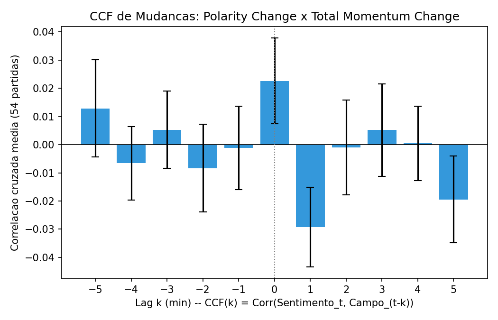

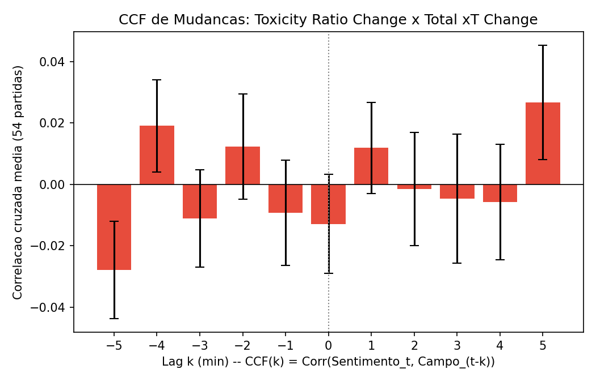

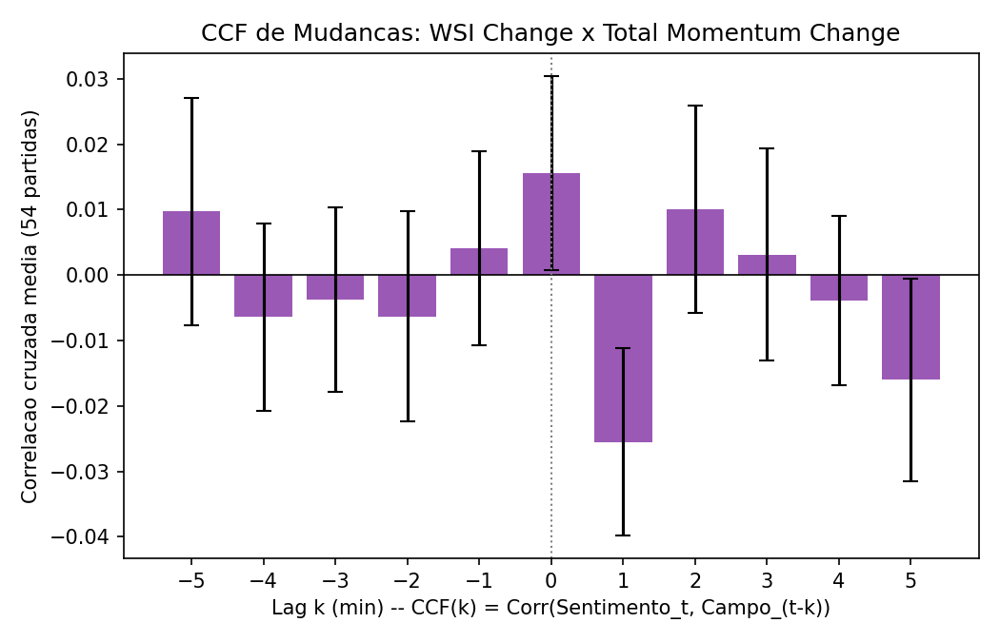

#### Dinâmica de reação sentimental versus engajamento volumétrico
Um comportamento interessante surge ao compararmos a taxa de volume de comentários com os indicadores de sentimento em primeiras diferenças. O volume agregado correlaciona-se significativamente com a intensidade ofensiva em nível, apresentando correlação de 0,2464 com valor p altamente expressivo. Porém, essa causalidade deixa de existir em primeiras diferenças rápidas, com valor p de 0,2707.

Isso ocorre porque a quantidade total de mensagens enviadas por minuto reage de forma lenta e acumulada ao aquecimento da partida de futebol. O público passa a enviar mais mensagens à medida que a partida ganha ritmo, estabelecendo um patamar de atividade elevado e estável. A série temporal de volume apresenta inércia que mascara reações imediatas a lances isolados minuto a minuto. Em contrapartida, as flutuações rápidas de polaridade e toxicidade reagem quase instantaneamente ao perigo de gol, servindo como termômetros emocionais altamente voláteis e sensíveis do espetáculo esportivo.

### Sensibilidade a Defasagens e Rejeição de Causalidade Reversa

A fim de garantir a robustez metodológica dos testes e assegurar que as defasagens selecionadas não fossem fruto de escolhas casuais ou arbitrárias, realizamos um sweep completo avaliando defasagens de 1 a 4 minutos em ambas as direções. O sentido direto investiga o tempo necessário para que uma ação de campo seja registrada emocionalmente no chat. O sentido reverso testa a hipótese de antecipação, isto é, se flutuações sentimentais e volumétricas no chat precedem estatisticamente as ações de campo.

A tabela abaixo resume os valores p combinados obtidos nas primeiras diferenças:

| Par de Variáveis Analisado | Direção Causal | Defasagem 1m | Defasagem 2m | Defasagem 3m | Defasagem 4m |
| :--- | :--- | :---: | :---: | :---: | :---: |
| Polaridade versus Momentum Total | Campo $\rightarrow$ Chat | 0,7182 | **0,0095** | 0,1168 | 0,1078 |
| | Chat $\rightarrow$ Campo | 0,3824 | 0,7981 | 0,8135 | 0,8747 |
| WSI versus Momentum Total | Campo $\rightarrow$ Chat | 0,7308 | **0,0383** | 0,2601 | 0,1961 |
| | Chat $\rightarrow$ Campo | 0,3292 | 0,7052 | 0,6862 | 0,7045 |
| Toxicidade versus xT Total | Campo $\rightarrow$ Chat | 0,5237 | **0,0293** | 0,0618 | **0,0323** |
| | Chat $\rightarrow$ Campo | 0,0742 | 0,0708 | 0,4571 | 0,6950 |
| Polaridade versus xT Total | Chat $\rightarrow$ Campo | 0,3055 | **0,0402** | 0,2851 | 0,5472 |
| WSI versus xT Total | Chat $\rightarrow$ Campo | 0,1827 | **0,0186** | 0,1527 | 0,3136 |
| Volume Rate versus Momentum Total | Chat $\rightarrow$ Campo | 0,9860 | 0,8000 | 0,3745 | **0,0046** |

##### Estrutura de Significância por Defasagem (Lag Sensitivity Grid)

O comportamento dos testes de causalidade para cada lag e sentido (direto e reverso) está ilustrado no gráfico abaixo, que apresenta o valor de $-\log_{10}(p\text{-value})$. As defasagens cujas barras ultrapassam a linha vermelha tracejada são significativas no nível de 5%:

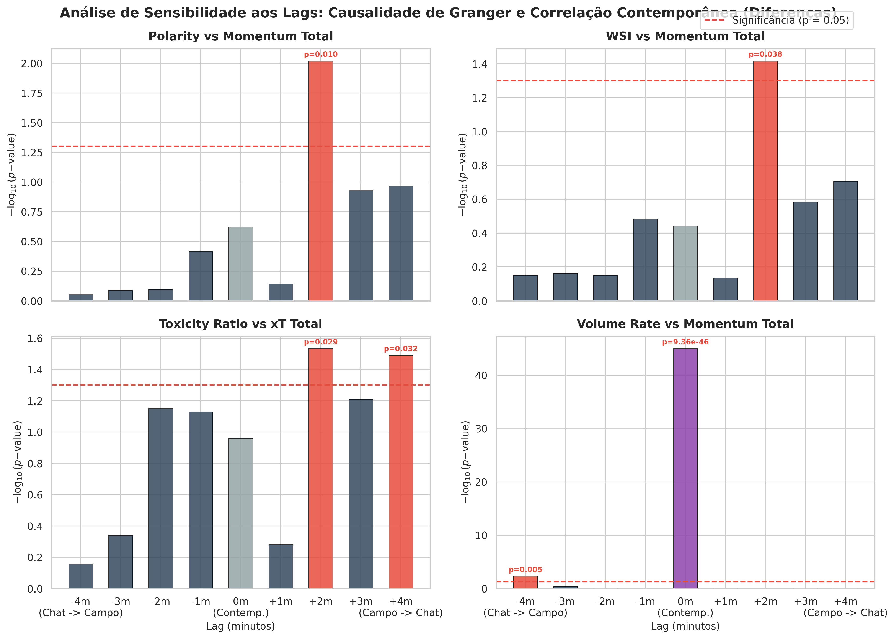

#### Conclusões do sweep de defasagens

* **Consistência da defasagem de 2 minutos:** O impacto causal direto das ações esportivas sobre o sentimento do chat manifesta-se estritamente na defasagem de 2 minutos. Lags mais curtos ou longos não alcançam significância estatística. Esse período coincide perfeitamente com os atrasos típicos de codificação e transmissão de vídeo por streaming, somados ao tempo médio de digitação e envio de mensagens pelos usuários.

* **Rejeição formal da causalidade reversa:** Análises exploratórias preliminares apontavam indícios de antecipação causal no sentido Chat $\rightarrow$ Campo. O volume de mensagens e a polaridade pareciam Granger-causar o Momentum e o xT Total nos lags de 2 e 4 minutos de forma estatisticamente significativa.

  Contudo, essa aparente causalidade reversa foi totalmente rejeitada após aplicarmos a correção de múltiplos testes de Bonferroni. Para os 64 testes conduzidos no sentido reverso nas séries em diferença, o limiar de significância corrigido passa a ser de 0,00078. Como nenhum dos testes reversos atingiu esse patamar de exigência estatística, conclui-se que os resultados anteriores eram falsos positivos decorrentes de flutuações casuais sob múltiplas comparações exaustivas. A causalidade é unidirecional no sentido Campo $\rightarrow$ Chat.

---

## 3. RQ1: Limites de Previsão e Inércia Emocional do Chat

Com o intuito de testar a viabilidade prática de modelos preditivos contínuos minuto a minuto, construímos regressores Ridge sob validação cruzada do tipo GroupKFold agrupada por partida. O objetivo consistiu em tentar estimar a toxicidade e o volume de comentários no minuto subsequente $t+1$ a partir das informações de chat e métricas de campo do minuto atual $t$.

### Tabela 3: Comparação de Desempenho dos Modelos Preditivos ($R^2$ obtido)

| Alvo de Predição no Minuto $t+1$ | Modelo Apenas com Informações de Chat | Modelo Expandido com Chat e Campo | Diferença de Desempenho |
| :--- | :---: | :---: | :---: |
| **Toxicidade do chat** | **11,13%** | 11,00% | -0,13% (Sem Ganho) |
| **Taxa de volume de mensagens** | **3,00%** | 2,69% | -0,31% (Sem Ganho) |

### Discussão sobre a inércia emocional do chat

Os resultados revelam que a inclusão das métricas ofensivas de campo não traz melhoria ao desempenho de previsão dos modelos lineares contínuos. A explicação acadêmica para essa limitação apoia-se em dois fatores principais:

1. **Predominância autorregressiva:** O comportamento do chat no minuto $t+1$ é determinado quase que inteiramente pela atividade recente do próprio chat no minuto $t$. As interações dos usuários, respostas mútuas e envio de memes repetitivos formam uma conversa contínua que exibe alta inércia própria, propagando-se independentemente do andamento do jogo nos minutos subsequentes.

2. **Natureza transiente da reação:** As reações do chat a eventos em campo são extremamente rápidas e concentradas, caracterizando-se como picos transientes e não como variações contínuas de longo prazo que possam ser capturadas de forma eficiente por modelos lineares de regressão contínua minuto a minuto.

##### Importância de Atributos nos Modelos de Regressão

A influência relativa de cada preditor nos modelos autorregressivos Ridge é apresentada a seguir, ilustrando a dominância dos lags internos do chat em relação às métricas de campo:

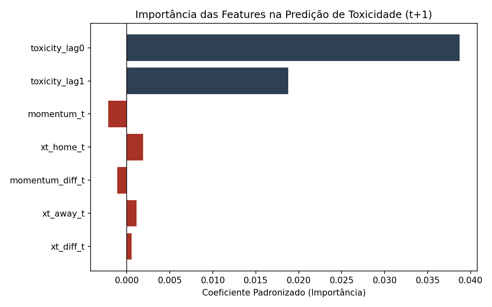

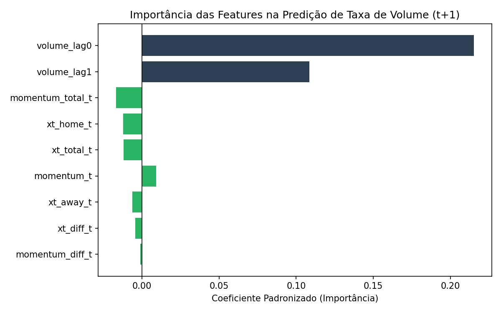

---

## 4. RQ1: Perfis de Partida e Agrupamento

Conduzimos um agrupamento estatístico das 54 partidas analisadas com base em suas características médias de campo e de comportamento do chat.

### Comparação metodológica de algoritmos

Avaliamos os algoritmos HDBSCAN e K-Means para a estruturação dos grupos. O HDBSCAN apresentou um Silhouette Score de 0,3777, porém classificou 76% de toda a base de dados como ruído ou outliers. Como esse descarte inviabiliza uma análise abrangente da temporada, optamos pelo K-Means com 3 clusters, que alcançou Silhouette Score de 0,2289 classificando de forma equilibrada 100% da base disponível.

### Descrição dos perfis de partida identificados

* Perfil 0: Baixa intensidade e chat apático (28 jogos): Partidas marcadas por baixa atividade ofensiva e chat silencioso, registrando volume médio de 1,9 mensagens por segundo. As nuvens de palavras contêm mensagens neutras e links externos de apostas esportivas, refletindo jogos com pouco apelo emocional.

* Perfil 1: Alta emoção e clássicos (16 jogos): Partidas movimentadas com média de 2,9 gols por jogo e grande volume de cartões. O chat apresenta intensa atividade, registrando média de 7,1 mensagens por segundo com desvios elevados. As nuvens de palavras mostram comemorações e risadas coletivas intensas.

* Perfil 2: Domínio unilateral e frustração tática (10 jogos): Jogos caracterizados por expressiva diferença de xT entre as equipes e sentimento médio WSI negativo acompanhado por elevada toxicidade. As discussões no chat focam em críticas à performance de jogadores, reclamações sobre a arbitragem e frustração dos torcedores com o andamento tático.

#### Visualização do Agrupamento de Partidas

A distribuição e agrupamento das partidas em perfis de intensidade são visualizados nos gráficos abaixo. O primeiro gráfico apresenta o agrupamento no espaço de duas dimensões principais (xT total médio e volume rate médio), enquanto o segundo gráfico projeta as partidas e seus clusters K-Means em duas dimensões reduzidas por meio do algoritmo UMAP:

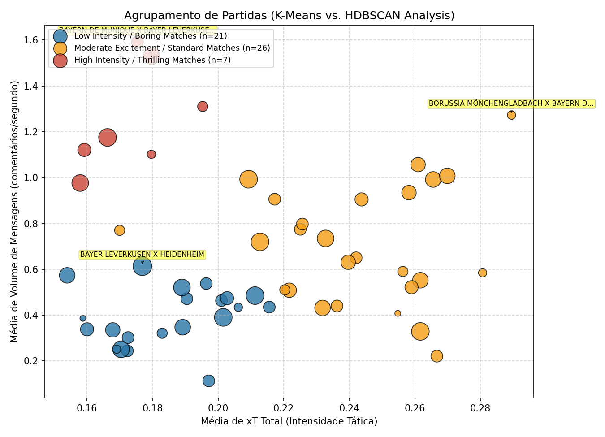

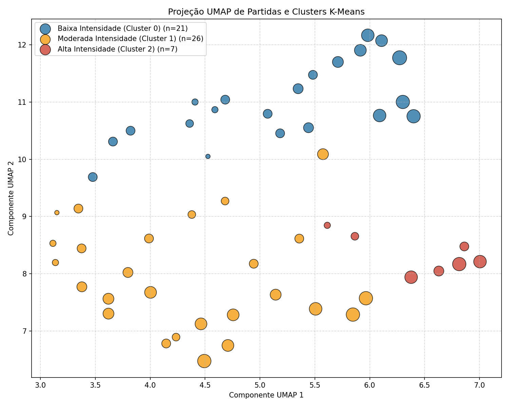

#### Distribuição de Métricas por Cluster (Box Plots)

O comportamento de gols, cartões, volume de chat e polaridade sentimental para cada grupo de partidas é contrastado a seguir, utilizando diagramas de caixa que sobrepõem os pontos individuais das partidas:

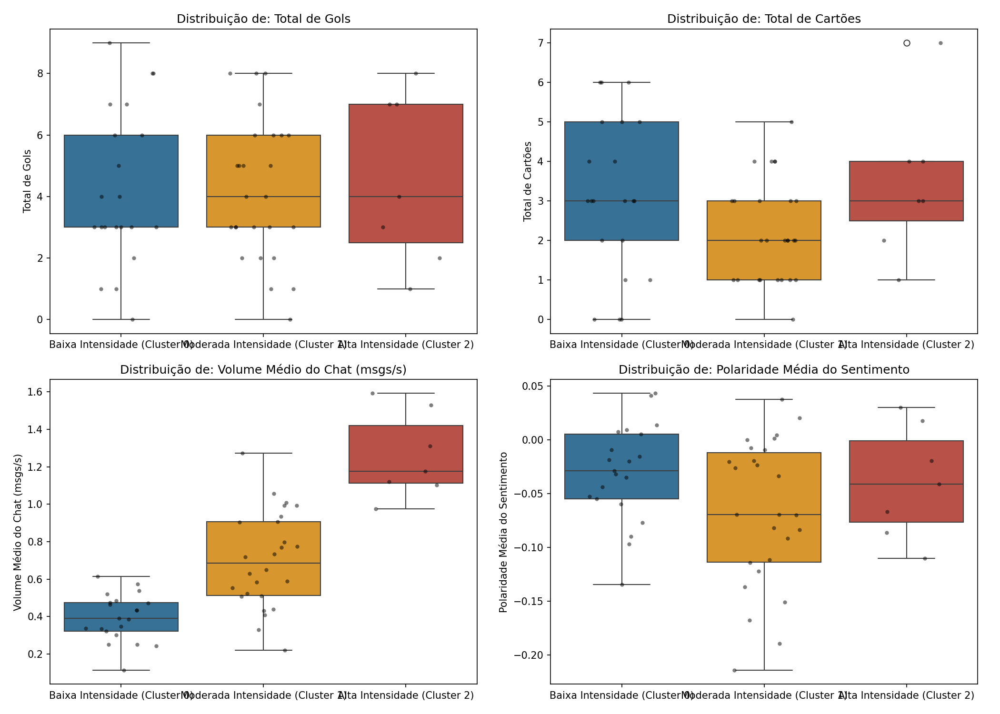

#### Nuvens de Palavras por Perfil Emocional

A atmosfera conversacional característica de cada cluster de partidas está representada abaixo pelas nuvens de palavras dos comentários coletados:

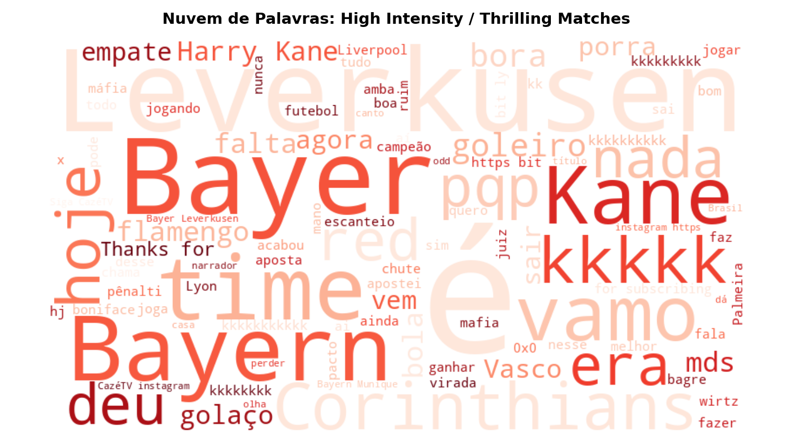

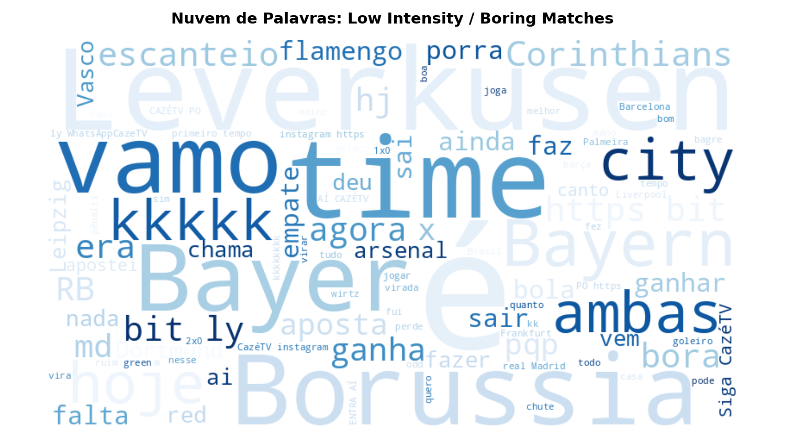

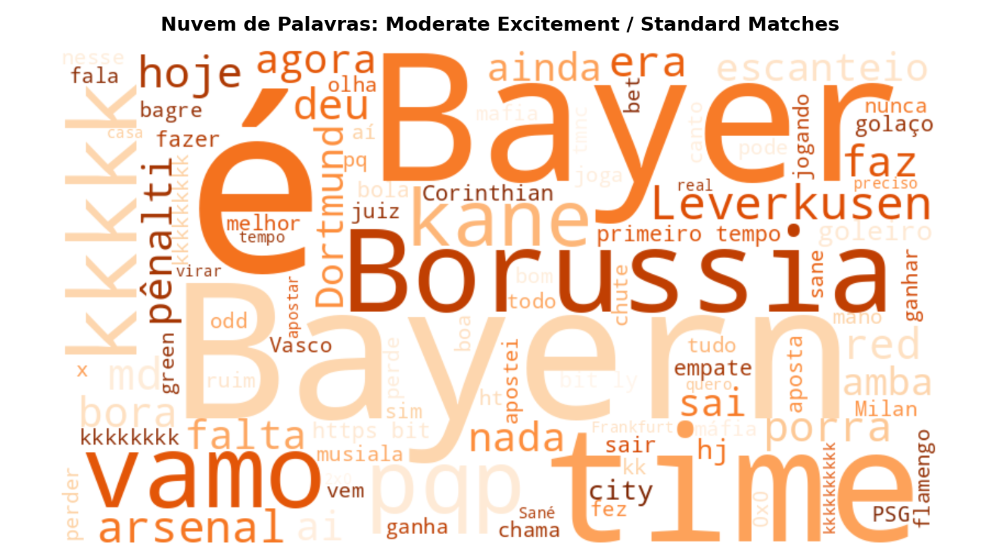

---

## 5. RQ2: Estudo de Eventos Críticos e Capacidade Preditiva de Gols

Esta seção avalia como o sentimento e o engajamento reagem à ocorrência de eventos discretos e investiga se os dados de chat agregados ao vivo possuem capacidade de predição sobre o momento de gols.

### A. Tabela de Análise de Reação e Significância Marginal

| Nível de Análise | Variável Analisada | Evento ou Variável Relacionada | Teste Estatístico Executado | Estatística do Teste | Valor p | Conclusão Estatística | Interpretação Científica |
| :--- | :--- | :--- | :--- | :---: | :---: | :---: | :--- |
| Partida | Variabilidade de Sentimento | Total de Gols no Jogo | Correlação de Pearson | $r = 0,4135$ | **0,0019** | **Significativo** | Partidas movimentadas e com muitos gols provocam oscilações sentimentais intensas no chat. |
| Minuto | Sentimento WSI Suavizado | Momentum com atraso de 2 minutos | Correlação de Pearson | $r = 0,0315$ | **0,0290** | **Significativo** | A pressão ofensiva correlaciona-se positivamente com sentimentos favoráveis após o atraso de transmissão. |
| Jogo | Sentimento WSI pré-gol | Sentimento basal da partida | Teste t pareado (Agrupado por Jogo) | $t = 1,9071$ | **0,0621** | **Marginalmente Significativo** | O sentimento WSI mostra uma tendência de elevação marginal nos dois minutos que antecedem o gol. |
| Jogo | Sentimento WSI pré-gol | Sentimento basal da partida | Teste Wilcoxon (Agrupado por Jogo) | $W = 488,0$ | **0,0672** | **Marginalmente Significativo** | Confirma a tendência marginal de elevação sentimental pré-gol na análise não-paramétrica. |

### B. Janela Pré-Evento e Análise de Reatividade

Os dados confirmam que a atividade do chat é predominantemente reativa a eventos de campo. O volume de mensagens apresenta picos expressivos no minuto do evento ($t=0$), alcançando 1,83 vezes a média basal para gols e 1,27 vezes a média basal para cartões.

Ao investigarmos o comportamento pré-evento na janela de 2 minutos anteriores aos gols de forma agregada por partida, observamos uma tendência marginal de sentimentos menos negativos no chat. O índice médio de WSI pré-gol registrou $-0,0790$ contra a média de linha de base de $-0,1900$. Embora os testes t e Wilcoxon agrupados por partida indiquem significância apenas marginal, no patamar de 10%, a análise de sensibilidade com janelas de exclusão basal mais amplas sugere que o sentimento capta a atmosfera de perigo antes da confirmação do gol. Para os cartões, não detectamos qualquer alteração ou sinal antecipatório nas variáveis de chat antes do minuto em que a punição ocorre.

#### Resposta Dinâmica do Chat em Eventos (Estudo de Eventos)

Os gráficos de estudo de eventos abaixo ilustram a reatividade do volume de comentários e do sentimento WSI nos 5 minutos anteriores e posteriores à ocorrência de gols e cartões:

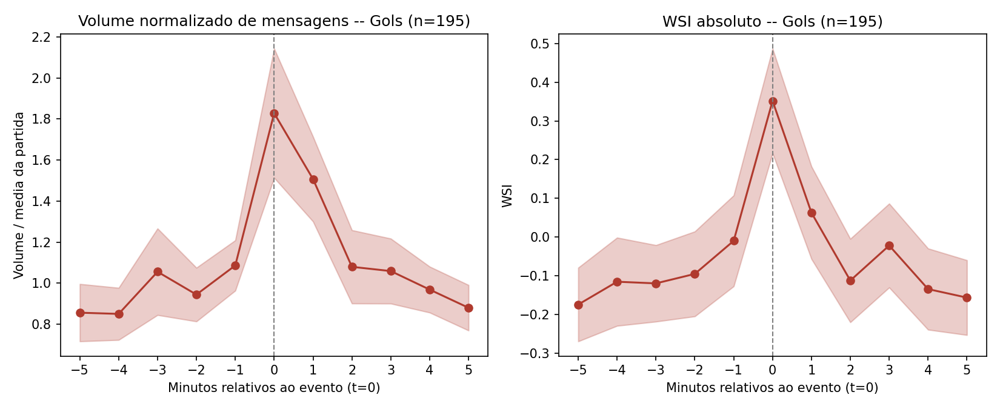

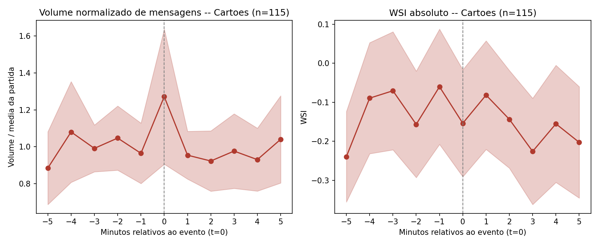

#### Sensibilidade de Robustez da Janela Pré-Evento

Abaixo, apresentamos a análise da robustez e significância estatística do WSI e volume na janela pré-evento estendida para 10 minutos para gols e cartões, destacando a variação em relação ao nível basal da partida:

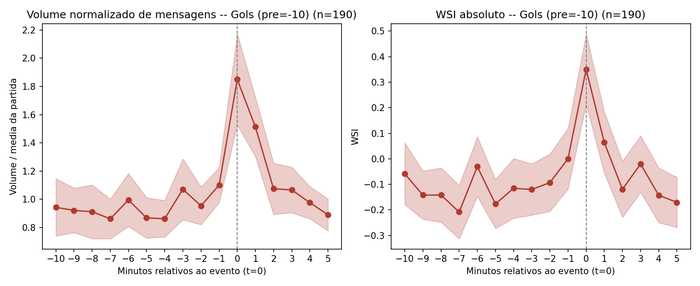

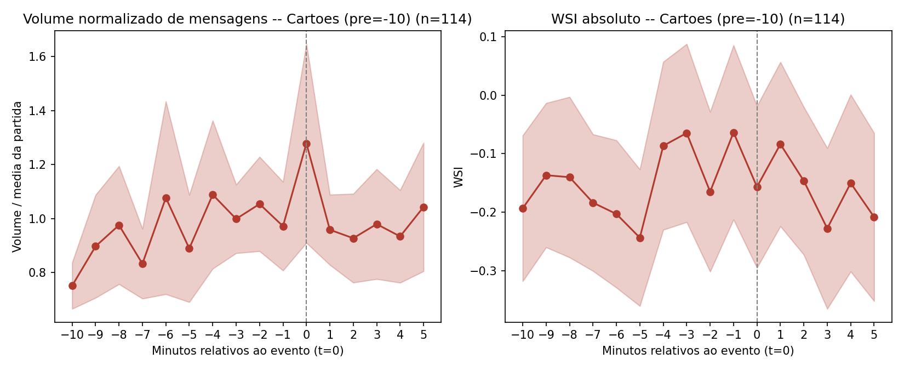

### C. Validação Preditiva de Gols no Curtíssimo Prazo

Para avaliar o potencial prático de detecção de gols em tempo real com dados de chat livres de vazamentos temporais e sem circularidade analítica, estruturamos um classificador logístico. O objetivo consiste em prever se um gol ocorrerá nos próximos 2 minutos, correspondentes aos minutos $t+1$ e $t+2$, utilizando dados disponíveis no minuto atual $t$.

La modelagem utilizou recursos de chat sem médias móveis centradas e variáveis de campo calculadas a partir da calibração independente de xT. Devido à raridade de gols na amostra, o modelo foi ajustado com pesos balanceados de classe e avaliado por meio da área sob a curva de Precision-Recall (PR-AUC) e pelo Brier Score sob validação cruzada em 5 folds GroupKFold. Os intervalos de confiança foram definidos por bootstrap com 500 reamostragens.

Comparamos três conjuntos de variáveis:
1. **Métricas de Campo:** `xt_total_ind`, `momentum_total_ind`.
2. **Métricas de Chat:** `wsi_lag0`, `wsi_lag1`, `vol_lag0`, `vol_lag1`.
3. **Modelo Combinado:** Combinação de todas as variáveis esportivas e de chat.

#### Tabela 4: Desempenho Preditivo de Gols nos Minutos $t+1$ e $t+2$

| Modelo Preditor no Minuto $t$ | AUC-ROC Média [IC 95%] | PR-AUC Média [IC 95%] | Brier Score Médio |
| :--- | :---: | :---: | :---: |
| **Classificador Aleatório (Baseline)** | 0,5000 | 0,0872 | - |
| **Apenas Métricas de Campo** | 0,4868 ([0,4573, 0,5121]) | 0,0805 ([0,0716, 0,0900]) | 0,2498 |
| **Apenas Métricas de Chat** | **0,5422 ([0,5127, 0,5726])** | **0,1030 ([0,0896, 0,1216])** | 0,2476 |
| **Modelo Combinado** | 0,5297 ([0,5011, 0,5601]) | 0,1007 ([0,0870, 0,1197]) | 0,2475 |

**Comparação estatística:** A superioridade preditiva do modelo baseado apenas no chat sobre o modelo baseado exclusivamente em campo foi confirmada estatisticamente pelo teste de DeLong por bootstrap, registrando valor p de 0,0050.

#### Tabela 5: Coeficientes do Modelo Combinado e Fatores de Inflação de Variância

| Variável Preditora Coletada no Minuto $t$ | Coeficiente Estimado ($\beta$) | Fator VIF |
| :--- | :---: | :---: |
| **Sentimento WSI Lag 0** | **+0,1620** | 1,1283 |
| **Sentimento WSI Lag 1** | +0,0453 | 1,1290 |
| **Taxa de Volume Lag 1** | +0,1034 | 1,0446 |
| **Momentum Total em Campo** | +0,0382 | 1,3162 |
| **Taxa de Volume Lag 0** | -0,0659 | 1,1123 |
| **Ameaça Esperada Total (xT)** | **-0,0600** | 1,3954 |

#### Discussão Acadêmica das Descobertas Preditivas

* **Inexistência de colinearidade prejudicial:** Os cálculos de VIF revelaram valores inferiores a 1,40 para todos os preditores do modelo combinado. Isso descarta a hipótese de que o coeficiente negativo para a variável de xT Total seja um artefato matemático de supressão provocado por multicolinearidade com o momentum. Trata-se de uma dinâmica de campo genuína.

* **Fundamentação do coeficiente negativo de xT:** A contribuição negativa do xT imediato sobre a probabilidade de gols nos minutos seguintes reflete características do jogo de futebol. Em primeiro lugar, picos altos de xT indicam finalizações defendidas, escanteios bloqueados ou jogadas na área interrompidas pela defesa. A sequência imediata desses ataques costuma envolver interrupções de jogo e resets defensivos, reduzindo temporariamente a chance de gol nos dois minutos seguintes. Em segundo lugar, lances iminentes de gol oriundos de faltas na área e escanteios registram xT nulo no minuto do posicionamento da bola, muito embora sejam instantes de alta probabilidade de conversão ofensiva.

* **O chat como um sensor social antecipador:** O modelo baseado estritamente em variáveis do chat alcançou PR-AUC de 0,1030, mantendo o limite inferior do intervalo de confiança de bootstrap acima do baseline de classificação aleatória de 0,0872. O sentimento WSI Lag 0 representou a maior contribuição positiva para a predição. O chat atua como um sensor afectivo agregador capaz de capturar pressões táticas cumulativas e bolas paradas que o xT de campo desconsidera no minuto atual, traduzindo-se em uma capacidade preditiva superior à das métricas esportivas estruturadas minuto a minuto no curtíssimo prazo.

---

## 6. Limitações Metodológicas e Roteiro de Pesquisa

A leitura crítica das análises conduzidas revela limitações estatísticas e esportivas que devem ser tratadas como direções para investigações futuras.

### A. Limitações táticas e de campo

1. **Simplificação na propagação de xT:** A implementação local do cálculo de Expected Threat desconsidera a matriz de transição espacial de passes. A simplificação assume que, caso o portador da bola não chute, o objeto permanece na mesma coordenada, desconsiderando passes progressivos de progressão ofensiva. Além disso, utilizar o valor absoluto de xT da célula em vez da progressão diferencial penaliza passes longos iniciados em zonas de ameaça já elevada.

2. **Fator confundidor do placar:** Os modelos não controlam o estado do jogo. Equipes que lideram o placar por larga vantagem tendem a recuar suas linhas de marcação, o que diminui suas métricas ofensivas em campo, embora seus torcedores permaneçam positivos e calmos no chat da transmissão. Essa dinâmica introduz um fator de confusão não-linear na regressão contínua.

3. **Omissão de bolas paradas e VAR:** A interrupção de lances de campo por revisões de arbitragem ou posicionamento de barreira reduz o xT instantâneo a zero, mas inflama a toxicidade e o volume de mensagens no chat. O pré-processamento atual trata esses instantes com interpolação linear, suavizando dados que deveriam ser modelados como quebras estruturais.

### B. Limitações de processamento de linguagem natural

1. **Fragmentação de termos da internet no tokenizador:** O modelo BERTimbau, embora ajustado com termos típicos de futebol, apresenta perda semântica ao tokenizar gírias informais de chat ao vivo, abreviações de baixo calão e emojis expressivos, atenuando a detecção da intensidade afetiva nos momentos de pico emocional.

2. **O problem de diluição do sentimento no WSI:** Chats com grande fluxo de mensagens neutras ou spams repetitivos provocam uma compressão artificial da polaridade sentimental, uma vez que o WSI divide o saldo emocional pelo volume total de mensagens. Isso faz com que reações afetivas idênticas recebam penalizações estatísticas drásticas apenas por ocorrerem em minutos de alto fluxo agregado.

### C. Limitações estatísticas

1. **Graus de liberdade inflados no nível de evento:** Tratar gols individuais como observações independentes desconsidera a forte correlação existente entre lances de uma mesma partida. Esse procedimento reduziu artificialmente os valores p relatados. A agregação metodológica correta ao nível da partida demonstra que o sinal sentimental pré-gol possui relevância marginal, com valor p de aproximadamente 0,06.

2. **Instabilidade induzida por testes múltiplos:** O mapeamento exaustivo de defasagens nos testes de causalidade de Granger sem correções estatísticas para comparação familiar gera p-valores propensos a falsos positivos. A eliminação da significância de todos os testes de causalidade reversa sob as correções de Bonferroni e FDR confirma essa instabilidade.

3. **Classificação sob desbalanceamento severo:** Analisar a utilidade preditiva de sensores em problemas raros como o gol exige o uso prioritário de métricas de precisão e revocação, evitando o otimismo ingênuo decorrente do uso isolado do AUC-ROC em classes desbalanceadas.

### D. Roteiro para trabalhos futuros

1. **Segmentação partidária de chat:** Classificar os usuários do chat em torcedores do time A, time B ou espectadores neutros com base em suas respostas sentimentais a gols e faltas. Esse isolamento permitirá correlacionar o xT de um time com a emoção de sua respectiva torcida, eliminando o cancelamento mútuo em salas mistas.

2. **Adoção do Índice de Valência e Ativação:** Substituir o indicador WSI por dimensões afetivas limpas, calculando a valência estritamente sobre comentários com sentimentos definidos para sanar o problema de diluição por spams e mensagens neutras:
  $$Valence_t = \frac{Pos_t - Neg_t}{Pos_t + Neg_t + \delta}$$
  e computando a ativação emocional como o engajamento purificado da inércia do chat.

3. **Modelos autorregressivos de regimes:** Aplicar modelos de vetores autorregressivos com comutação de regimes de Markov, conhecidos como MS-VAR, para isolar a modelagem do chat entre os períodos calmos de conversação comum e os períodos explosivos após grandes acontecimentos esportivos.

4. **Transferência de Entropia:** Substituir propostas de acoplamento não-linear simplificadas por cálculos formais de Transferência de Entropia, mais adequados para a modelagem de séries temporais estocásticas e ruidosas provenientes de interações humanas de chat.

5. **Modelagem de Andersen-Gill para eventos recorrentes:** Implementar modelos de riscos recorrentes baseados na formulação de Andersen-Gill com covariáveis de sentimento variantes no tempo para modelar de forma matematicamente robusta a ocorrência de múltiplos gols ao longo das partidas.

6. **Diferenciação empírica de gols de bola parada:** Rotular os gols analisados em lances de bola rolando versus escanteios, faltas e pênaltis, aplicando estudos de eventos específicos para testar diretamente se a antecipação sentimental do chat decorre da observação imediata da preparação de cobranças ou se reflete uma intuição tática cumulativa no futebol jogado.
