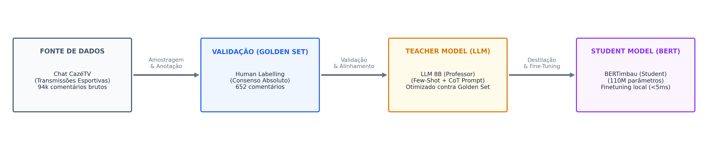
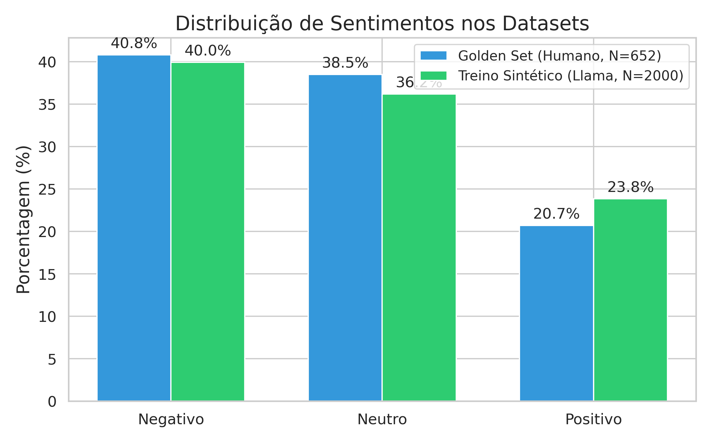
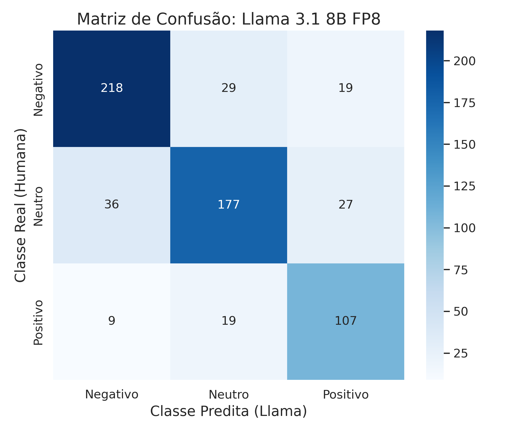
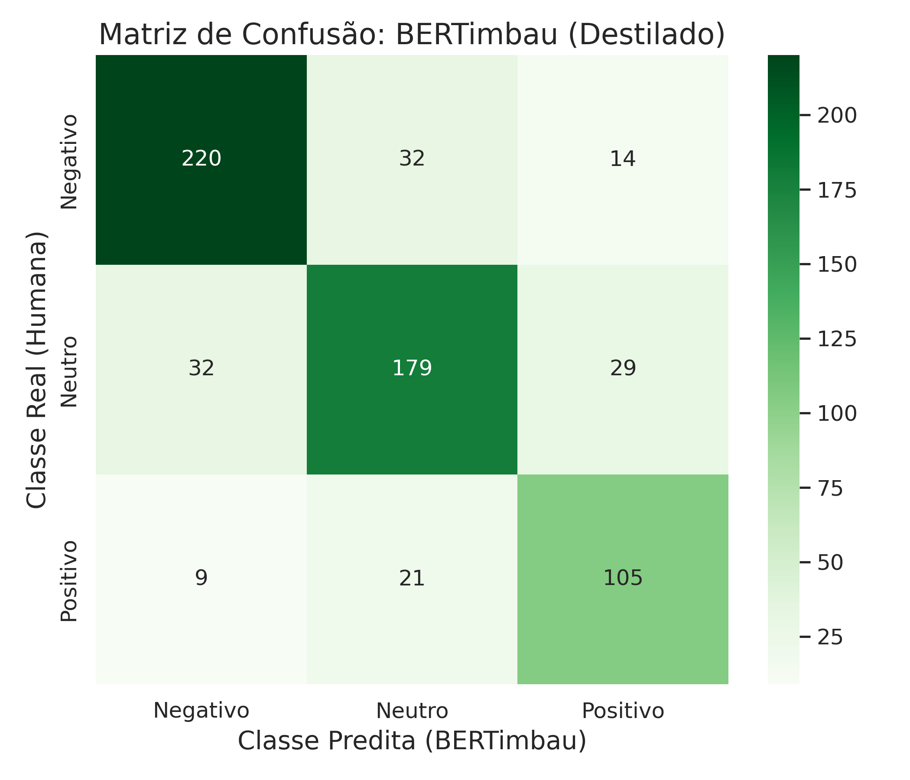

# TP3: Modelagem e Análise de Dados (Relatório de Progresso e Validação)

**Grupo:** Alvaro, Dani, Igor, Ivan, Vitor  
**Data:** 02 de Junho de 2026  
**Disciplina:** CDAF  

---

## 1. Estratégia de Modelagem

Para abordar o desafio de **Análise de Sentimento Multi-classe** (Positivo, Negativo, Neutro) em live chats do YouTube (especificamente transmissões da CazéTV), adotamos uma estratégia baseada em **Destilação de Conhecimento (Knowledge Distillation)**. O chat de futebol apresenta desafios únicos, como uso de gírias locais ("bagre", "jogar de terno"), termos de aposta ("green", "red", "odd"), sarcasmo e alta velocidade de envio de mensagens.

O pipeline de modelagem foi estruturado da seguinte forma:
1. **Construção do Golden Set Humano**: 5 rotuladores do grupo anotaram de forma independente comentários em pares. Apenas comentários com 100% de consenso foram selecionados, gerando uma base de validação altamente confiável de **652 mensagens**.
2. **Alinhamento do Teacher Model (Llama-3.1-8B-FP8)**: Refinamos um prompt estruturado contendo regras explícitas para gírias esportivas, pouca carga emocional (classe Neutro por padrão) e exemplos few-shot.
3. **Geração de Dados Sintéticos**: O Llama rotulou um conjunto aleatório de **2.000 mensagens** de chat extraídas dos dados brutos.
4. **Treinamento do Student Model (BERTimbau-base)**: Treinamos o BERTimbau-base (~110M parâmetros) de forma supervisionada sobre o dataset de 2k mensagens rotuladas pelo LLM.

### O Prompt do Llama (Teacher Model)
Abaixo, o prompt completo de sistema estruturado para alinhar o modelo Llama 3.1 com a intuição humana. As seções estão destacadas por cores:

    

        <strong>[1. DEFINIÇÃO DE PAPEL / PERSONA]</strong>
Você é um especialista em análise de sentimentos para chats de futebol da CazéTV.
Seu objetivo é classificar comentários seguindo o consenso de especialistas humanos.
    

    
    

        <strong>[2. REGRA GERAL - VIÉS DE NEUTRALIDADE]</strong>
REGRA GERAL (O DEFAULT É NEUTRO):
Se o comentário NÃO contiver uma emoção forte e clara (positiva ou negativa), ele DEVE ser classificado como 1 (NEUTRO).
    

    
    

        <strong>[3. CATEGORIAS DETALHADAS]</strong>
CATEGORIAS DETALHADAS:
0 (NEGATIVO): Apenas se houver toxicidade, raiva, ironia ácida ou decepção evidente:
  - Frustração real com o andamento do jogo ou perda de apostas (ex: 'tomei red', 'esquece', 'perdi tudo', 'essa ambas tá difícil').
  - Siglas de xingamento/irritação (ex: 'TNC', 'FDP', 'VTNC') ou gírias de aposta estragada (ex: 'lasca a bet').
  - Críticas de desempenho ou sarcasmo contra jogadores/times (ex: 'kane deve estar assistindo TV', 'não fez nada até agora', 'brigou com a mulher', 'time medíocre').
  - Reclamações contra a arbitragem, marcações de falta ou VAR (ex: 'foi falta no goleiro', 'máfia', 'roubo').
  - Provocações hostis entre torcidas rivais (ex: 'vai pipocar de novo', 'sem mundial').

1 (NEUTRO): Comentários comuns, perguntas, curiosidades, mensagens de sistema e conversas gerais sem forte carga emocional:
  - Perguntas e dúvidas informativas sobre o jogo ou regras (ex: 'Sesko chutou a gol?', 'é tipo Botafogo SP ou RJ?').
  - Fatos objetivos sem opinião emocional (ex: 'Leverkusen está invicto', 'o jogo começou').
  - Mensagens do sistema ou leituras mecânicas (ex: 'Thanks for subscribing Julio Cesar').
  - Pedidos ou saudações simples sem emoção exagerada (ex: 'salve para Osasco', 'tô com saudades da Kings League').
  - Palpites e análises de apostas meramente técnicos e secos (ex: 'odd de 1.50 pro Bayer', 'esse jogo é ambas marca').

2 (POSITIVO): Apenas comemoração, apoio, otimismo ou elogio claro:
  - Elogios diretos ao visual, beleza, habilidade ou técnica (ex: 'Que homem gato', 'joga muito', 'goleiraço').
  - Vibração por gol, jogadas boas ou apoio/torcida ao time (ex: 'GOL', 'vamo bayer', 'bayer é gigante').
  - Expectativa positiva ou comemoração em apostas/gols (ex: 'preciso de 1 gol', 'hoje sai green', 'hoje tem gol', 'ambos marcam e Borussia ganha').
  - Uso de emojis claramente alegres (:D, S2, 😍) que demonstram felicidade com a transmissão/jogo.
    

    
    

        <strong>[4. DIRETRIZES DE DECISÃO / REGRAS DE BORDA]</strong>
DIRETRIZES DE DECISÃO:
- Se o comentário tiver torcida/apoio combinado com uma reclamação leve (ex: 'a máfia tá no Borussia, vamo Bayer'), a torcida prevalece -> classifique como 2.
- Elogiar ou enaltecer o potencial de um time comparativamente (ex: 'se não fosse o Barcelona, seria campeão', 'Bayer é o Flamengo da Alemanha') é um elogio -> classifique como 2.
- Perguntas informativas sobre estatísticas ou apostas (ex: 'Sesko chutou a gol?') são sempre 1, nunca 0 ou 2.
- Comentários zombando levemente, mas sem agressividade ou xingamento pesado, ou meras piadas cotidianas são 1.
    

    
    

        <strong>[5. EXEMPLOS FEW-SHOT COM CHAIN-OF-THOUGHT (CoT)]</strong>
EXEMPLOS DE CONCORDÂNCIA HUMANA:
1. "NÃO SAI 1 CARTÃO VELHO KKKKK 2X2 E NENHUM CARTÃO" -> Resposta: {"raciocinio": "Frustração clara e indignação com aposta/jogo.", "sentimento": 0}
2. "hoje tou sentindo o green já" -> Resposta: {"raciocinio": "Otimismo e expectativa positiva com aposta.", "sentimento": 2}
3. "Dei cash no jogo do leverkusen" -> Resposta: {"raciocinio": "Fato sobre ação técnica de aposta sem emoção.", "sentimento": 1}
4. "Schick cabeça de lego kkkkkkkkk" -> Resposta: {"raciocinio": "Apelido depreciativo / insulto a jogador.", "sentimento": 0}
5. "preciso de 1 gol aqui e 1 no jogo BESIKTAS" -> Resposta: {"raciocinio": "Torcida e expectativa ativa por gols.", "sentimento": 2}
6. "Botafogo vai pipocar de novo" -> Resposta: {"raciocinio": "Provocação pejorativa prevendo fracasso do time.", "sentimento": 0}
7. "eu já tomei red hj no fenerbahce" -> Resposta: {"raciocinio": "Lamentação / frustração por perda de aposta (red).", "sentimento": 0}
8. "Que homiiii gato. Nossa senhora" -> Resposta: {"raciocinio": "Elogio entusiasmado ao visual do jogador/técnico.", "sentimento": 2}
9. "o sesko chutou no gol rapaziada???" -> Resposta: {"raciocinio": "Pergunta informativa sobre estatística do jogo.", "sentimento": 1}
10. "era pra ter mostrado a linha da bola" -> Resposta: {"raciocinio": "Observação técnica sobre a transmissão sem agressividade.", "sentimento": 1}
11. "bayern sempre lasca a bet de td mundo" -> Resposta: {"raciocinio": "Frustração com o time estragando a aposta ('lascar a bet').", "sentimento": 0}
12. "essa ambas tá difícil TNC" -> Resposta: {"raciocinio": "Uso de sigla ofensiva (TNC) e frustração com aposta.", "sentimento": 0}
13. "Bayer é o flamengo da Alemanha" -> Resposta: {"raciocinio": "Comparação positiva enaltecendo a grandeza/popularidade do time.", "sentimento": 2}
    

    
    

        <strong>[6. RESTRIÇÃO E FORMATO DE SAÍDA]</strong>
Responda EXCLUSIVAMENTE em JSON: {"raciocinio": "...", "sentimento": X}
    

---

## 2. Insights Preliminares

Os dados rotulados e analisados revelaram os seguintes comportamentos importantes:
- **Subjetividade Extrema**: O cálculo da concordância inter-anotador humana (Cohen's Kappa) resultou em **0.472** (concordância moderada). Isso mostra que os torcedores interpretam a mesma mensagem de maneiras distintas (por exemplo, ironias ou termos de aposta neutros vs. comemoração).
- **Desbalanceamento das Classes**: Há um forte desbalanceamento com predominância de comentários negativos (zoações e críticas) e neutros (perguntas técnicas e termos de aposta sem emoção). O sentimento positivo (celebração direta de gols e apoio) é menos frequente no fluxo contínuo do chat.

Abaixo, apresentamos a comparação da distribuição de sentimentos nos datasets:

### Validação Estatística do Tamanho da Amostra
Para garantir a representatividade estatística das nossas conclusões frente ao universo total de **94.540 comentários**, validamos o tamanho das nossas amostras utilizando a fórmula de tamanho amostral para populações finitas com **95% de confiança** e variabilidade máxima de população ($P = 0.5$):

    najustado
    =
    

        n
        1 + (n - 1) &frasl; N
    

    onde
    n
    =
    

        Z2 &middot; P &middot; (1 - P)
        E2
    

- **Golden Set Humano (N = 652)**: Supera com folga o limite de **383 amostras** exigido para o erro amostral padrão de **5%**, posicionando-se em uma margem de erro aproximada de **3,8%**. Isso garante que a nossa base de validação humana é estatisticamente robusta.
- **Dataset de Treino Sintético (N = 2.000)**: Atinge uma margem de erro de apenas **2,18%** (muito próxima do patamar exigente de 2%), garantindo que o modelo BERTimbau foi exposto a uma amostragem altamente representativa do comportamento geral do chat para seu treinamento supervisionado.

---

## 3. Métricas Iniciais

### Escolha e Justificativa das Métricas
Para avaliar os modelos em relação aos labels humanos consensuais, selecionamos três métricas:
1. **Acurácia**: Taxa geral de acertos do modelo.
2. **F1-Score (Weighted)**: Nossa métrica principal. Trata as classes de maneira proporcional ao seu suporte, garantindo que o modelo seja penalizado adequadamente se falhar na classe minoritária (Positivo), contornando o desbalanceamento.
3. **Cohen's Kappa**: Mede a concordância corrigindo o acerto ao acaso. É fundamental para avaliar a consistência da IA frente a anotações subjetivas.

### Resultados de Avaliação (Golden Set)
Abaixo, consolidamos a concordância entre os rotuladores humanos e os modelos:

| Relação | Métrica de Concordância | Valor | Nível de Concordância |
| :--- | :--- | :---: | :--- |
| **Humano vs Humano** | Cohen's Kappa Global | **0.472** | Moderada |
| **Baseline vLLM (Qwen 7B) vs Humano** | Cohen's Kappa / Acurácia | **0.501** / 69.0% | Moderada |
| **Llama-3.1-8B-FP8 (Otimizado) vs Humano** | Cohen's Kappa / Acurácia | **0.690** / 80.2% | **Substancial** |
| **BERTimbau (Destilado) vs Humano** | Cohen's Kappa / Acurácia | **0.698** / 80.8% | **Substancial** |

*Nota: No dataset fundido (712 exemplos incluindo duplicatas), o BERTimbau destilado obteve **80.8% de acurácia** e **0.698 de Cohen's Kappa**, ligeiramente superando o seu próprio professor Llama 8B (80.2% de acurácia e 0.690 de Kappa).*

Abaixo estão as matrizes de confusão obtidas na avaliação:

    

        
        
Matriz de Confusão: Llama 3.1 8B FP8

    

    

        
        
Matriz de Confusão: BERTimbau (Destilado)

    

---

## 4. Próximos Passos

Estabelecemos o seguinte cronograma e atividades para as próximas etapas do projeto:

| Atividade | Objetivo |
| :--- | :--- |
| **Refinamento do Golden Set** | Resolver divergências de anotações humanas (10% restantes) para expandir base de validação. |
| **Tuning do BERTimbau** | Experimentar otimizadores e scheduling de learning rate para estabilizar o treinamento. |
| **Integração Final de Features** | Cruzar o sentimento médio do chat em blocos de tempo com o momentum (xT) e eventos da partida. |
| **Relatório Final e Dashboard** | Entrega da análise consolidada e do painel interativo. |
